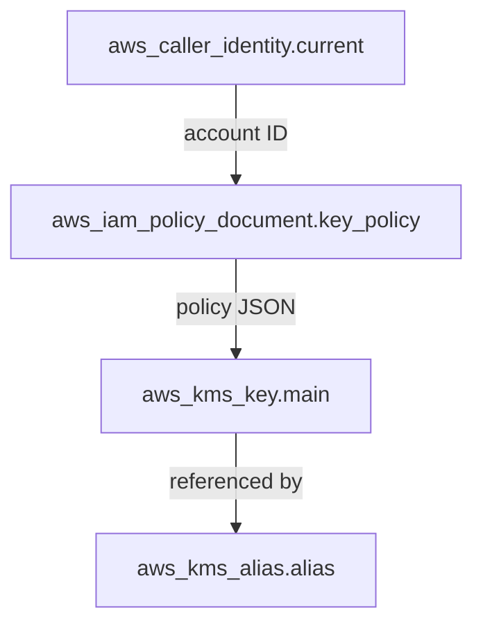

# Architecture

## How It Works

The module creates two AWS resources and uses two data sources:



### Resources Created

| Resource | Name | Purpose |
|----------|------|---------|
| `aws_kms_key.main` | KMS key | The symmetric encryption key with key rotation enabled |
| `aws_kms_alias.alias` | `alias/{key_name}` | Human-readable alias for the key |

### Data Sources

| Data Source | Purpose |
|-------------|---------|
| `aws_caller_identity.current` | Gets the AWS account ID for the root principal in the key policy |
| `aws_iam_policy_document.key_policy` | Builds the key policy JSON from the variable inputs |

## Key Policy Structure

The key policy always includes a root account statement and conditionally adds
up to three additional statements based on the input variables:

### 1. Root Account Access (always present)

```json
{
  "Sid": "Enable IAM User Permissions",
  "Effect": "Allow",
  "Principal": { "AWS": "arn:aws:iam::<account-id>:root" },
  "Action": "kms:*",
  "Resource": "*"
}
```

This ensures the key can always be managed by the account owner, preventing lockout.

### 2. Full Access (`key_users`)

Grants encrypt + decrypt + re-encrypt + generate data key + describe:

- `kms:Encrypt`
- `kms:Decrypt`
- `kms:ReEncrypt*`
- `kms:GenerateDataKey*`
- `kms:DescribeKey`

### 3. Encrypt Only (`key_encrypt_only_users`)

Grants encrypt + re-encrypt-to + generate data key + describe:

- `kms:Encrypt`
- `kms:ReEncryptTo`
- `kms:GenerateDataKey*`
- `kms:DescribeKey`

Note: Only `kms:ReEncryptTo` is granted (not `kms:ReEncryptFrom`) to prevent
re-encryption-based data exfiltration.

### 4. Decrypt Only (`key_decrypt_only_users`)

Grants decrypt + describe:

- `kms:Decrypt`
- `kms:DescribeKey`

## Dynamic Statements

Each user list variable (`key_users`, `key_encrypt_only_users`, `key_decrypt_only_users`)
uses a Terraform `dynamic` block that only creates the policy statement when the variable
is non-null and non-empty:

```hcl
for_each = try(length(var.key_users), 0) > 0 ? [1] : []
```

This handles both `null` (default) and `[]` (empty list) gracefully, avoiding
invalid KMS key policies with empty principal lists.

## Tagging

The KMS key is tagged with:

| Tag | Value |
|-----|-------|
| `service` | `var.service_name` |
| `environment` | `var.environment` |
| `created_by_module` | `infrahouse/key/aws` |
| `module_version` | Current module version |
| + any tags from `var.tags` | |
